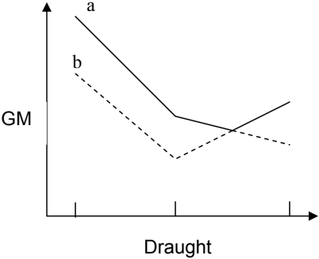
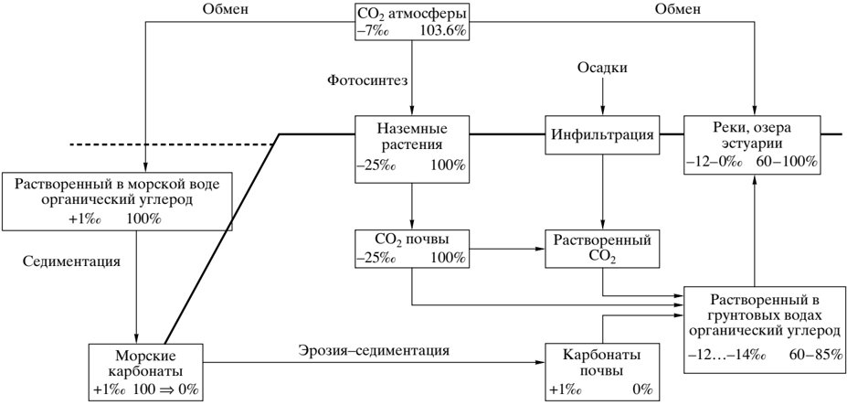
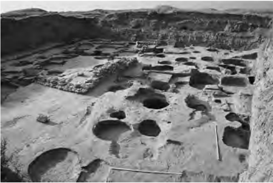
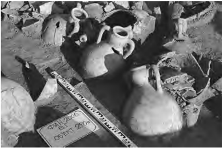

SLF 49/3

ANNEX 1

Page 8

[The  limiting  curves  with  instruction  for  use  should  be  included  in  the  Stability  Information provided to the Master.  The effective trim range of the curve shall be clearly stated.]

| Limit   | Draught   | Draught   | Draught   |
|---------|-----------|-----------|-----------|
| Lines   | l         | p         | s         |
| a       | Actual    | Level     | Level     |
| b       | [Max      | Max       | Max       |
| b       | Trim &gt;-   | Trim      | Trim      |
| b       | 0.5%L]    | &gt;-        | &gt;-        |
| b       | or        | 0.5%      | 0.5%      |
| b       |           |           | L         |
| b       | [Actual]  | L         |           |

[The GM values for the three loading conditions could, as a first attempt, be taken from the intact stability GM limit curve.  If a required index A is not obtained, the GM values could be increased but still taken into account that the intact loading conditions from the intact stability book should meet the GM limit curve from the damage stability (linear interpolation between the three GMs).]

## Regulation 6 GLYPH&lt;150&gt; Required subdivision index R

## Paragraph 1

To demonstrate compliance with these provisions, see the guidelines in Appendix 1 regarding the presentation of damage stability calculation results.

## Regulation 7 GLYPH&lt;150&gt; Attained subdivision index A

## Paragraph 1

The probability of surviving after [collision] damage to the ship hull is expressed by the index A. Producing an index A requires calculation of various damage scenarios defined by the extent of damage and the initial loading conditions of the ship before damage.  Three loading conditions are to be considered and the result weighted as follows:

<!-- formula-not-decoded -->

where the indices s, p, l represents the three loading conditions and the factor to be multiplied to the index, indicates how the index A from each loading condition is weighted.

The method of calculating the A for a loading condition is expressed by the formula:

<!-- formula-not-decoded -->

ë Âχ ˆËÍ· ÌÂÓ ı  '‡Ì˘ÂÒÍÓ'Ó Û'Π Ó%‡.

ÒÓÒÚÓËÚ Ë Í‡ÍËÏ Ó·  ‡ÁÓÏ  Ú‡ ÔÓÔ "  ‡,͇ ÏÓÊÂÚ · ˚ Ú¸ , ˚ ˜ËÒÎÂ̇.

## êÄÑàéìÉãÖêéÑçéÖ ÑÄíàêéÇÄçàÖ éÅêÄáñéÇ åéêëäéÉé à êÖóçéÉé èêéàëïéÜÑÖçàü

éÒÌÓ, ˚  ‡%ËÓÛ'Π Ó%ÌÓ'Ó ÏÂÚÓ%‡ ·‡ÁË  ˛ Û ÚÒ fl ̇ 14 C %‡ÚË  Ó,‡ÌËË Ì‡ÁÂÏÌ ˚ı Ó·  ‡ÁˆÓ,, ÍÓÚÓ ˚  ̇ Ó% ÚÒ   , ı fl fl  ‡,ÌÓ,ÂÒËË  Ò  ‡ÚÏÓÒÙ  ˚ Ì Ï  Û'Π Ó%ÓÏ. ᇠ'ÒÓ,  ÂÏÂÌÌÛ ˛ ‡ÍÚË,ÌÓÒÚ¸',  ‡,ÌÛ ˛ 100%, Ô ËÌËχÂÚÒ  ‡ÍÚË,ÌÓÒÚ¸ %  fl  Â,ÂÒËÌ ˚ 1950 '. ̇¯ÂÈ "˚ .  èÓÔ  ‡,͇ ̇ ËÁÓÚÓÔÌÓ ٠ ‡ÍˆËÓÌË Ó,‡ÌËÂ,  Ô Ë,Â%ÂÌ̇  Í ÒÚ‡Ì%‡  fl  ÚÌÓÏÛ Á̇˜ÂÌË ˛ -25 % ,  ÓÒÌÓ, ˚ ,‡ÂÚÒ   ̇  ÓÔ fl  Â%ÂÎÂÌÌÓÏ  ÒÓÓÚÌÓ¯ÂÌËË  ÒÚ‡·ËÎ¸Ì ˚ı ËÁÓÚÓÔÓ, Û'Π Ó%‡ , %  Â,ÂÒËÌ -  13 C/ 12 C. é·Â%ÌÂÌË ËÎË Ó·Ó'‡ ˘ ÂÌË χÚ  ˇÎÓ, ̇ÁÂÏÌÓ'Ó Ô ÓËÒ ÓÊ%ÂÌË   14 C Ô  ı fl  ÓËÒ Ó%ËÚ , ı  ÂÁÛθڇÚ ËÁÓÚÓÔÌÓ'Ó Ù  ‡ÍˆËÓÌË Ó,‡ÌË .  fl

Ç ÓÍ‡Ì˘ÂÒÍÓÈ ,Ó% Á̇˜ÂÌË δ 13 C %Î fl  ‡ÒÚ,Ó- ÂÌÌÓ'Ó Ó  '‡Ì˘ÂÒÍÓ'Ó Û'Π Ó%‡ ÒÓÒÚ‡,Î ÂÚ Ô fl  ËÏ ÌÓ +1  % (  ËÒÛÌÓÍ).  ê‡,ÌÓ,ÂÒËÂ Ò ‡ÚÏÓÒÙ  ÓÈ, Ó%̇ÍÓ, Ô  Â%ÔÓ·'‡ÂÚ  14 ë ‡ÍÚË,ÌÓÒÚ¸ 105%. è  Â%ÔÓÎÓÊËÏ, ˜ÚÓ Û ÒÓ,  ÂÏÂÌÌ ˚ı Ó·  ‡ÁˆÓ, ̇ÁÂÏÌÓ'Ó Ô ÓËÒ ÓÊ%ÂÌË   Á̇˜ÂÌË   ‡ÍÚË,ÌÓÒÚË  ı fl fl 14 C  ‡,ÌÓ 100% Ë δ 13 C -25 % .  éÌË Ì‡ ı Ó% ÚÒ  , fl fl  ‡,ÌÓ,ÂÒËË Ò ‡ÚÏÓÒÙÂ Ì  ˚ Ï ëé2. í‡Í Í‡Í Á̇˜ÂÌË δ 13 C %Î  ëé fl 2 ÒÓÒÚ‡,Î ÂÚ +7 fl % ,  ÚÓ ÒÓÓÚ,ÂÚÒÚ,Û ˛˘ fl ‡  ‡ÍÚË,ÌÓÒÚ¸  ‡%ËÓÛ'Π Ó%‡ ‡ÚÏÓÒÙ ˚ 14 a  =  103.6% .  ùÚÓ  ÒÓ2 '·ÒÛÂÚÒ fl Ò  Ô  ÓˆÂÒÒÓÏ ËÁÓÚÓÔÌÓ'Ó Ù  ‡ÍˆËÓÌË Ó- ,‡ÌË : ÔÓÒÍÓθÍÛ  14 C = 2 fl δ 13 C, δ 13 C Û,Â΢Ë,‡ÂÚÒ  ÓÚ fl -25 % %Ó -7 % ̇ 18 % , Ú‡ÍËÏ Ó·  ‡ÁÓÏ  14 C Û,Â΢Ë-

,‡ÂÚÒ  ̇ 36 fl % = 3.6%. è  ËÌËχ  ,Ó ,ÌËχÌË ӷfl ÏÂÌ  ÏÂÊ%Û  ‡ÚÏÓÒÙ  ÓÈ  Ë  ÓÍ‡Ì˘ÂÒÍÓÈ  ,Ó%ÓÈ  Ë  ‡ÁÌËˆÛ , Á̇˜ÂÌË flı δ 13 C %Î  Ó·ÓË fl ı  ÂÁ  ,Û‡  Ó, Û'Π Ó%‡, ÔÓÎÛ˜‡ÂÏ Á̇˜ÂÌË ‡ÍÚË,ÌÓÒÚË  14 ‡ = 105%; , ÚÓ ,  ÂÏ  Í‡Í , fl  ‡θÌÓÒÚË  ÚÓ Á̇˜ÂÌË ÒÓÒÚ‡,Î " fl -ÂÚ 100%.

í‡Í‡  ÒËÚÛ‡ˆË  ÏÓÊÂÚ · fl fl ˚ Ú¸ Ó· ˙fl ÒÌÂ̇ ÒÎÂ%Û ˛ -˘ ËÏ Ó· ‡ÁÓÏ. Ç Ó͇̠,  ˚ %ÂÎ fl˛ ÚÒ fl ÔÓ, ı ÌÓÒÚÌ ˚ È  Ë  'ÎÛ·ËÌÌ ˚ È  ,Ó%Ì ˚   ÒÎÓË.  Å ˚ ÒÚ ˚ È  Ó·ÏÂÌ CO2  Ë  ÒÓÓÚ,ÂÚÒÚ,ÂÌÌÓ 14 CO2  ÒÛ ˘ ÂÒÚ,ÛÂÚ  ÚÓθÍÓ ÏÂÊ%Û ÔÓ, ı ÌÓÒÚÌ ˚ Ï ÒÎÓÂÏ ,Ó% ˚ Ë ‡ÚÏÓÒÙ  ÓÈ, ÚÓ'%‡ Í‡Í ÒÓÓÚ,ÂÚÒÚ,Û ˛˘ ËÈ Ó·ÏÂÌ ÏÂÊ%Û 'ÎÛ·ËÌÌ ˚ Ï Ë ÔÓ, ı ÌÓÒÚÌ ˚ Ï ,Ó%Ì ˚ ÏË ÒÎÓ ÏË Ô fl  ÓËÒ Óı %ËÚ Ó˜Â̸ ÏÂ%ÎÂÌÌÓ. ç‡ 'ÎÛ·ËÌ ËÁÓÚÓÔÌ ˚ È ÒÓÒÚ‡, Û'Π Ó%‡ Ú fl ÊÂÎÂÂ Ë ‡ÍÚË,ÌÓÒÚ¸ Û'Π Ó%‡  14 C ·ÓΠÌËÁ͇ , ˜ÂÏ Ì‡ ÔÓ, fl ı ÌÓÒÚË. Ç  ÂÁÛθڇÚ ÔÓ% ˙ Âχ ,Ó% ˚ Ò 'ÎÛ·ËÌ ˚ ÔÓ, ı ÌÓÒÚÌ ˚ È ,Ó%Ì ˚ È ÒÎÓÈ ËÏÂÂÚ ‡ÍÚË,ÌÓÒÚ¸  14 C ÏÂ̸¯Â, ˜ÂÏ ÓÊË%‡ÂÏ ˚  105%. Ç ëÂ,  ÌÓÏ ÄÚ·ÌÚ˘ÂÒÍÓÏ Ó͇̠Á̇˜ÂÌË ‡ÍÚË,ÌÓÒÚË  14 C - 100%. ê‡ÁÌˈ‡ , 5% " Í,Ë,‡ÎÂÌÚ̇ 400  14 C 'Ó%‡Ï, Ë ÔÓ " ÚÓÏÛ ,Ò ,Ó%Ì ˚  ӷ  ‡Áˆ ˚ Ó͇Á ˚ ,‡ ˛ ÚÒ fl %  Â,Ì ̇ 400 ÎÂÚ, Ô  ËÓ· ÂÚ‡  ÏÌËÏ  fl ˚ È ,ÓÁ  ‡ÒÚ. í‡ÍËÏ Ó·  ‡ÁÓÏ, %‡ÚË  fl Û  ÏÓ  ÒÍË ӷ  ‡Áˆ ˚ Ë Ô  Â,Ó%  ÔÓÎÛ˜ÂÌÌ fl ˚ È  ‡%ËÓÛ'Π Ó%Ì ˚ È ,ÓÁ  ‡ÒÚ , ͇ÎÂÌ%‡  ˚ Ì È,  ÒÓ'·ÒÌÓ Ô  ËÌ Ú fl ˚ Ï ÒÓ'·¯ÂÌË Ï fl ÌÂÓ· Ó%ËÏÓ ÔÓÏÌËÚ¸, ˜ÚÓ ÏÓ ı  ÒÍË ӷ  ‡Áˆ ˚ ÔÓÎÛ-˜‡ ˛ ÚÒ fl %  Â,ÌÂÂ, ˜ÂÏ ÒËÌ ı ÓÌÌ ˚  ËÏ Ì‡ÁÂÏÌ ˚  ËÎË ‡ÚÏÓÒÙÂ Ì  ˚ Â. á̇˜ÂÌË , 400 ÎÂÚ ÓÔ  Â%ÂÎÂÌÓ  ‡ÁÌˈÂÈ %‡ÚË  Ó,ÓÍ ÒËÌ ı ÓÌÌ ˚ı ,Ó%Ì ˚ı Ë Ì‡ÁÂÏÌ ˚ı Ó· ‡ÁÓ, Ë  fl ,Î ÂÚÒ  ÔÓÔ fl fl  ‡,ÍÓÈ Ì‡ " ÙÙÂÍÚ ÏÓ ÒÍÓ- 'Ó  ÂÁ  ,Û‡  ‡ -∆ R. é%̇ÍÓ ÔÓÒÎÂ%ÌË ËÒÒÎÂ%Ó,‡ÌË  ÔÓ͇Á‡ÎË, ˜ÚÓ Í ÌÂÈ %ÓÎÊÌ fl ˚ %Ó·‡,Î fl Ú¸Ò fl  ˘ Â Ë %ÓÔÓÎÌËÚÂθÌÓ  Â'ËÓÌ‡Î¸Ì ˚  ÔÓÔ  ‡,ÍË (ë‡,Ë̈ÍËÈ,  ï‡Ò‡ÌÓ,,  2004).  åÓ  ÒÍÓÈ  ÂÁ  ,Û‡  ˚ Ì È " Ù-

퇷Îˈ‡ 1. ÇÎË ÌË fl  ÂÁ  ,Û‡  ÌÓ'Ó " ÙÙÂÍÚ‡  ̇  ,ÓÁ- ‡ÒÚ  Ó·  ‡ÁˆÓ,  ˜ÌÓÈ ˚ ˚ · ËÁ  ‡ÁÎË˜Ì ˚ı ,Ó%ÓÂÏÓ, çË% ·Ì%Ó, 

|   ÉÓηÌ%Ò- ÍË ,Ó%ÓÂÏ ˚ |   ÉÓ% 'Ë·ÂÎË |   14 a(%) , ‡ÚÏÓ- ÒÙ   |   14 a(%)  ÓÔ  Â%Â- ÎÂÌÌ ˚ È |   ëÓÓÚÌÓ- åÌËÏ ¯ÂÌË fl |   ˚ È ,ÓÁ  ‡ÒÚ |
|--------------------------|--------------|---------------------------|-------------------------------|------------------------|-----------------|
|                        1 |         1990 |                       115 |                          87.3 |                  0.759 |            2215 |
|                        2 |         1994 |                       112 |                          82.1 |                  0.733 |            2495 |
|                        3 |         1989 |                       116 |                         102.3 |                  0.882 |            1010 |
|                        4 |         1989 |                       116 |                          74   |                  0.638 |            3610 |

ÙÂÍÚ Ô ËÒÛÚÒÚ,ÛÂÚ Ì ÚÓθÍÓ , ÏÓ   ÒÍË  Ó ı  '‡ÌËÁχ , Ú‡ÍË ı ı Í‡Í ˚ ·‡,  ‡ÍÓ,ËÌ ˚ , ÌÓ Ú‡ÍÊÂ Ô  fl Ó ,Î fl ÂÚÒ fl Ô  ÓÔÓ ˆËÓ̇θÌÓ Û ÊË,ÓÚÌ  ˚ı Ë  ˜ÂÎÓ,Â͇, , ÒËÒÚÂÏ ÔËÚ‡ÌË  ÍÓÚÓ fl ˚ı Ô  ËÒÛÚÒÚ,Û ˛ Ú ÏÓ  ÂÔ  Ó%ÛÍÚ ˚ .

é· ‡  ˘ ‡ÂÏ ,ÌËχÌË ̇ ÚÓ, ˜ÚÓ Ô  ÂÒÌÓ,Ó%Ì ˚  ,Ó%ÓÂÏ ˚ · ˚ ,‡ ˛ Ú  ÒÚÓ fl ˜ËÂ Ë Ô  ÓÚÓ˜Ì ˚ Â.  è  ÓÚÓ˜Ì ˚  ,Ó%ÓÂÏ ˚ -" ÚÓ  ÂÍË, ÍÓÚÓ ˚  ÔËÚ‡ ˛ ÚÒ fl Ô  ÂËÏÛ ˘ ÂÒÚ,ÂÌÌÓ  '  ÛÌÚÓ,ÓÈ  ,Ó%ÓÈ.  îËÎ¸Ú  ˛˘ fl fl Û ‡ Ò ˜Â  ÂÁ ÔÓ˜,Û %ÓÊ%Â,‡  ,Ó%‡ fl  ‡ÒÚ,Ó fl ÂÚ CO2 , ÍÓ  -ÌÂÓ·ËÚ‡ÂÏÓÈ ÚÓÎ ˘  ÔÓ˜, ˚ . ùÚÓÚ CO  ËÏÂÂÚ ÒÓ, 2  ÂÏÂÌÌÛ ˛ 14 C ‡ÍÚË,ÌÓÒÚ¸ Ë δ 13 C = -25 % . Ç ÚÓÏ ÒÎÛ˜‡Â, ÂÒÎË ÔÓ˜,ÓÓ·  ‡ÁÛ ˛˘ ËÏË ËÎË ÔÓ%ÒÚË· ˛˘ ËÏË ÔÓ  Ó%‡ÏË ÒÎÛÊ‡Ú ÏÓ  ÒÍË ͇  ·Ó̇ÚÌ ˚  ÔÓ  Ó% ˚ , , '  ÛÌÚÓ, ˚ı ,Ó%‡ ı Ô  ÓËÒ Ó%ËÚ ı  ‡ÒÚ,Ó  ÂÌË %  Â,ÌÂ'Ó ëé2 ͇  ·Ó̇ÚÓ,, ÍÓÚÓ ˚ È ËÏÂÂÚ ·ÂÒÍÓ̘ÌÓ  χÎÓ  ÒÓ%  ʇÌË  14 C  ( 14 a  =  0)  Ë  Á̇˜ÂÌË δ 13 C = -12 % . ê‡ÒÚ,Ó  ÂÌË %ÓÔÓÎÌËÚÂθÌÓ'Ó ëé  Ë 2 Ô ÓˆÂÒÒ  ˚ Ó·ÏÂ̇ ëé2 , 'ÎÛ·ÓÍË ı 'Ó  ËÁÓÌÚ‡  ÔÓ˜ı , ˚ Ë ÔÓ  Ó%‡  ,Ì ÍÓ ı  ÌÂÓ·ËÚ‡ÂÏÓÈ ÚÓÎ ˘ Ë Ô  Ë,Ó% Ú fl Í ËÁÏÂÌÂÌË ˛ Á̇˜ÂÌËÈ  14 ‡, Í‡Í ÔÓ͇Á‡ÌÓ Ì‡  ËÒÛÌÍÂ.  á̇˜ÂÌË ÒÓ,  ÂÏÂÌÌÓÈ ‡ÍÚË,ÌÓÒÚË  14 a = 85%, Ó· ˚ ˜ÌÓ %Î  ,Ó% fl  .  êÂÈÌ, ÒÓÓÚ,ÂÚÒÚ,ÛÂÚ " ÙÙÂÍÚÛ  ÂÁ  ,Û‡  ‡  ,  1200  ÎÂÚ.  ùÚÓ  ÓÁ̇˜‡ÂÚ, ˜ÚÓ Ò,Âʇ fl ˚ ·‡ ËÁ  . êÂÈÌ, ÂÒÎË  ‡ÒÚ,Ó  ÂÌÌ ˚ È Í‡  ·ÓÌ‡Ú %ÂÈÒÚ,ËÚÂθÌÓ ÔÓÒÚÛÔ‡ÂÚ , ˚ ·Û ÔÓ ÔË ˘ Â, ˚ Ï ˆÂÔ Ï, fl ·Û%ÂÚ ËÏÂÚ¸ ,ÓÁ  ‡ÒÚ 1200 ÎÂÚ ÓÚ Ì‡ÒÚÓ fl˘ Â'Ó ,  ÂÏÂÌË. è  Ë  ‡%ËÓÛ'Π Ó%ÌÓÏ %‡ÚË  Ó,‡ÌËË ÊË,ÓÚÌ ˚ı Ë Î ˛ %ÂÈ, , ÔË ˘ Â,ÓÏ  ‡ˆËÓÌ ÍÓÚÓ ˚ı Ô  Âӷ·%‡ÂÚ Ô ÂÒÌÓ,Ó%̇  fl ˚ ·‡, ·Û%ÂÚ Ú‡ÍÊ ̇·Î ˛ %‡Ú¸Ò fl  ÂÁ  ,Û‡  ˚ Ì È " ÙÙÂÍÚ, Ë,  Ú‡ÍËÏ  Ó·  ‡ÁÓÏ,  ÔÓÎÛ˜ÂÌÌ ˚   ‡%ËÓÛ'Π Ó%Ì ˚  %‡Ú ˚ ÔÓ Ú‡ÍËÏ Ó·  ‡Áˆ‡Ï ·Û%ÛÚ ËÏÂÚ¸ ÏÌËÏ ˚ È ,ÓÁ  ‡ÒÚ.

Ç  ‡ÍÓ,Ë̇ ı  ÂÁ  ,Û‡  ˚ Ì È " ÙÙÂÍÚ  · ˚ Î  ÓÚÍ ˚ Ú Ì‡ Á‡    ‡%ËÓÛ'Π Ó%ÌÓÈ "˚ . è  Ë %‡ÚË  Ó,‡-

ÌËË ÏÓ  ÒÍË ı  ‡ÍÓ,ËÌ ˜ÂÚ,  Ú˘ÌÓ'Ó Ô  ËÓ%‡ · ˚ · ÓÔ Â%ÂÎÂ̇  ÔÓÔ   ‡,͇  ̇  ÂÁ  ,Û‡  ˚ Ì È " ÙÙÂÍÚ: ∆ R = 400 ÎÂÚ. í‡ÍË ËÁÏ  ÂÌË fl fl ,Î fl˛ ÚÒ fl ˜‡ÒÚ¸ ˛ ͇ÎË· Ó,Ó˜ÌÓÈ  Ô   ÓˆÂ%Û ˚ (Reimer  et  al., 2004; Hughen et al., 2004).

êÂÁ  ,Û‡  ˚ Ì È " ÙÙÂÍÚ , ˚fl ,ÎÂÌ %Î fl  Â˜Ì ˚ı  ‡-ÍÓ,ËÌ, ,Ó%Ó  ÓÒÎÂÈ, ˚ · (Olsson, 1983). ç‡Ô  ËÏ ,   ÂÁ  ,Û‡  ˚ Ì È " ÙÙÂÍÚ Ô Ó ,Î ÂÚÒ  , ÏÓÎÎ  fl fl fl ˛ Ò͇  Ë ı ˚ ·‡   ËÁ ı  ‡ÁÌ ˚ı  Â˜Ì ˚ı ,Ó%ÓÂÏÓ,  çË%  ·Ì%Ó, (Lanting, Plicht, 1995-1996) (Ú‡·Î. 1).

Ç  ‡Ï͇  ̇¯Â'Ó ËÒÒÎÂ%Ó,‡ÌË  · ı fl ˚ · Ô  Ó%‡ÚË- Ó,‡Ì‡ ˚ ·‡ ËÁ ÓÁ  ‡ ÑÂÂ%-ïÛÎÒÛÌ (Ú‡·Î. 2). ùÚÓ ÔÓ͇Á‡ÎÓ  Ô  ËÒÛÚÒÚ,Ë  ÂÁ  ,Û‡  ÌÓ'Ó " ÙÙÂÍÚ‡  , ËÒÒÎÂ%ÛÂÏÓÏ ÓÁ  Â. í‡Í‡ fl Ê ÒËÚÛ‡ˆË fl ı ‡  ‡ÍÚ  ̇ Ë %Î fl  ÂÍ ëÂ,  ÌÓ'Ó ä‡,͇Á‡ (Warren et al., 2006).

## ëíÄÅàãúçõÖ àáéíéèõ Ç èàôÖÇõï ñÖèüï ( 13 C,  15 N)

àÒÒÎÂ%Ó,‡ÌË  ËÁÓÚÓÔÌÓ'Ó Ù fl  ‡ÍˆËÓÌË Ó,‡ÌË  ,  fl Ò, fl ÁË Ò  ‡%ËÓÛ'Π Ó%Ì ˚ Ï %‡ÚË  Ó,‡ÌËÂÏ ÔÓ͇Á‡ÎË, ˜ÚÓ Á̇˜ÂÌË fl δ 13 C , ÍÓη'ÂÌ ÍÓÒÚÂÈ ˜ÂÎÓ,Â͇ Ë ÊË,ÓÚÌÓ'Ó ÏÓ'ÛÚ ÓÔ  Â%ÂÎ Ú¸Ò  Â'Ó ÒËÒÚÂÏÓÈ ÔËÚ‡fl fl ÌË . ê‡ÒÚÂÌË fl fl  ‡Á%ÂÎ fl˛ ÚÒ fl ̇ %, '  ÛÔÔ ˚ ÔÓ Ï ı ‡-ÌËÁÏÛ ÙÓÚÓÒËÌÚÂÁ‡:  ‡ÒÚÂÌË  ' fl  ÛÔÔ C3 Ë C4. éÌË  ‡Á΢‡ ˛ ÚÒ fl Ë ÔÓ ÒÓ%  ʇÌË ˛ δ 13 C (Vogel, 1980): %Î fl  ‡ÒÚÂÌËÈ  '  ÛÔÔ ˚ C3 δ 13 C  =  -25 % ;  ‡  C4 δ 13 C = -12 % . ç‡Ë·ÓΠ ‡ÒÔ  ÓÒÚ  ‡ÌÂÌÌ ˚   ‡ÒÚÂÌË  Ô fl  Ë̇%ÎÂÊ‡Ú Í '  ÛÔÔ ë3 (ÒÚ‡Ì%‡  Ú %Î fl  ‡Ò˜ÂÚ‡ ÔÓÔ ‡,ÍË  ̇ ËÁÓÚÓÔÌÓ ٠‡ÍˆËÓÌË Ó,‡ÌË   δ 13 C = -25 % , Ú‡ÍËÏ Ó·  ‡ÁÓÏ, Ó̇ %·ÂÚÒ fl ,  ‡Ò˜ÂÚ ̇  ‡ÒÚÂÌË  ' fl  ÛÔÔ ˚ ë3). ä  ‡ÒÚÂÌË Ï ' fl  ÛÔÔ ˚ ë4 ÓÚÌÓÒ ÚÒ  Ô fl fl  ÓÒÓ, ÍÛÍÛ  ÛÁ‡ Ë Ò‡ ı  ‡ Ì ˚ È Ú  ÓÒÚÌËÍ.

é%̇ÍÓ, ËÁÏ  Ë, δ 13 C, ÌÂ,ÓÁÏÓÊÌÓ ÓÔ  Â%ÂÎËÚ¸, fl ,Î ÂÚÒ  ÎË Â'Ó ·Óθ¯Â Á̇˜ÂÌË (ÓÍÓÎÓ -21 fl fl % )  ÂÁÛθڇÚÓÏ  ,ÍÎ ˛ ˜ÂÌË   ,  ÒËÒÚÂÏÛ  ÔËÚ‡ÌË fl fl ÏÓ  -ÒÍÓÈ ˚ ˚ · ËÎË  ‡ÒÚÂÌËÈ  '  ÛÔÔ ˚ C4.  á̇˜ÂÌË fl δ 13 C = -21 % ÏÓÊÂÚ ÓÁ̇˜‡Ú¸ Í‡Í ,Â'ÂÚ‡  ˇÌÒÍÛ ˛ ÒËÒÚÂÏÛ ÔËÚ‡ÌË , Ú‡Í Ë Òϯ‡ÌÌ fl ˚  ÒËÒÚÂÏ ˚ ÔËÚ‡ÌË , ÎË·Ó Ò ÍÓÏÔÓÌÂÌÚ‡ÏË Ï Ò‡ ̇ÁÂÏÌ fl fl ˚ı ÊË,ÓÚÌ ˚ı Ë  ˜ÌÓÈ ˚ ˚ · , ÎË·Ó ÒÓÒÚÓ fl˘ Û ˛ ËÁ ÏÓ  ÒÍÓÈ Ë  ˜ÌÓÈ ˚ ˚ · . í‡ÍËÏ Ó·  ‡ÁÓÏ, ÎËÌÂÈÌ ˚  Òϯ‡ÌÌ ˚    ÏÓ%ÂÎË   (ÔÓÔ  ‡,ÍË 14 C  ,ÓÁ  ‡ÒÚ‡  Ò  Û˜ÂÚÓÏ ÚÓθÍÓ δ 13 C) Ì ,  ˚ Ì .

àÁÏ ÂÌË Á̇˜ÂÌË  fl δ 13 C - Ó· fl Á‡ÚÂθ̇  Ô fl  ÓˆÂ%Û  ‡  %Î fl ,Ò ı  ‡%ËÓÛ'Π Ó%Ì ˚ı ··Ó  ‡ÚÓ  ËÈ.  çÓ Î˯¸ ÌÂÍÓÚÓ ˚   ··Ó  ‡ÚÓ  ËË  ÒÂ'Ó%Ì fl ËÁÏ fl˛ Ú δ 15 N.  àÒÔÓθÁÛ fl Á̇˜ÂÌË fl δ 15 N  Í‡Í  %ÓÔÓÎÌËÚÂθ-

퇷Îˈ‡ 2. ÇÎË ÌË fl  ÂÁ  ,Û‡  ÌÓ'Ó " ÙÙÂÍÚ‡ ̇ ,ÓÁ  ‡ÒÚ Ó·  ‡Áˆ‡ ˚ ˚ · ËÁ ÓÁ  ‡ ÑÂÂ%-ïÛÎÒÛÌ

| å‡Ú ˇΠ   | ã‡·Ó ‡ÚÓ   Ì ˚ È ÌÓÏ  ÉÓ% 'Ë·ÂÎË   | 14 ë ,ÓÁ  ‡ÒÚ, , 'Ó%‡ ı ÓÚ Ì‡¯Ë  %ÌÂÈ (AD) ı   | àÌÚ ,‡Î ͇ÎË·   Ó- ,‡ÌÌÓ'Ó ,ÓÁ  ‡ÒÚ‡ 1 σ , (AD) (̇˜‡ÎÓ : ÍÓ̈)  ,  Ó ÚÌÓÒÚ¸ fl   |
|--------------|----------------------------------------|-------------------------------------------------|------------------------------------------------------------------------------------------|
| ë‡Á‡Ì        | àÉÄç-3232 2005                         | 560 ± 50                                        | (1315 : 1355) 0.54 (1389 : 1422) 0.46                                                    |

êËÒ. 2. ÇË% ̇  ‡ÒÍÓÔ 'Ç ı ÌËÈ 'Ó  Ó%' Ò ûÇ.

 ÓÌÂÌË   ,  ‡ÏÙÓ fl  ı ‡ .  ç‡  ,  ¯ËÌ  'Ó ˚ å‡ÈÒÍÓÈ (Í ˛ 'Û ÓÚ 'Ó  Ó%Ë ˘ ‡) ËÒÒÎÂ%Ó,‡ÌÓ Ò, fl ÚËÎË ˘  ÊÂÌÒÍÓ'Ó ·ÓÊÂÒÚ,‡, fl %ÓÏ Ò ÍÓÚÓ ˚ Ï Ì‡È%ÂÌÓ ÏÌÓ'Ó ,ÓÚË,Ì ˚ı Ú  ‡ÍÓÚÓ, ˚ı ÒÚ‡ÚÛ " ÚÓÍ VI-III ,,. %Ó Ì. " . (å‡ ˜ÂÌÍÓ,  1960.  ë.  101-107;  1962.  ë.  121-133;  1963. ë. 86-90).

Ç 1979-1991 ' '.  ‡·ÓÚ ˚ ̇ ˛ ÊÌÓÈ ÓÍ ‡ËÌ î‡- ̇'Ó  ËË Ë Ì‡ ˜‡ÒÚË ,ÓÒÚÓ˜ÌÓ'Ó ÌÂÍ  ÓÔÓÎ  Ô fl  Ó,Ó%ËÎ  Ç.ë.  ÑÓÎ'Ó  ÛÍÓ,  (Ú  ‡Ì¯Â  ÔÓ% Ú fl  Û·ÓÔ  Ó,Ó%, 570 × 5 Ï; ÔÎÓ ˘ ‡%¸ Ò Ô   Ë ÂÁ͇ÏË ·ÓΠ3000 Ï 2 ), ÓÚÍ ˚ , ÒÎÓË ÓÚ Ì‡˜‡Î‡ V ,. %Ó Ì. " . %Ó ÍÓ̈‡ ‡ÌÚ˘ÌÓÒÚË.  ë  Â%Ë  ÏÌÓ'Ó˜ËÒÎÂÌÌ ˚ı ÒÓÓ  ÛÊÂÌËÈ:  Ó· ˘ ÂÒÚ,ÂÌÌÓ Á%‡ÌËÂ Ò Ó¯ÚÛ͇ÚÛ  ÂÌÌ ˚ ÏË ÒÚÂ̇ÏË; Ì·Óθ¯ÓÈ ı ‡Ï  ,  ‡ÌÚ‡ ı ;  '%ÓÏ  ÚÓ  'Ó,ˆ‡  Á  ÌÓÏ'; ÊËÎ ˚  %Óχ " ÎÎËÌËÒÚ˘ÂÒÍÓ'Ó ,  ÂÏÂÌË ËÁ Ò ˚ ˆÓ,Ó'Ó  ÍË  Ô˘‡;  ,ËÌÓ%ÂθÌË;  Ú  ‡Ì¯Â  , fl ˚ ·Ó ÍË 'Ó-  Ó%ÒÍÓÈ Ó·Ó  ÓÌËÚÂθÌÓÈ ÒÚÂÌ ˚ ; ÏÌÓ'ÓÒÎÓÈÌÓ ÏÓ-˘ ÂÌË ÛÎˈ ˚ IV ,. %Ó Ì. " . (ËÁ 'Ó  Ó%‡ , Ì‡Ô  ‡,ÎÂÌËË å‡ÈÒÍÓÈ 'Ó ˚ ). éÒÓ·Ó , ˚ %ÂÎËÏ ,Ô  ˚ ,  ̇È%ÂÌÌ ˚   ,  î‡Ì‡'Ó  ËË ÏÓ'ËÎ ˚ ‡ ı ‡Ë˜ÂÒÍÓ'Ó ,  ÂÏÂÌË, χÒÚ  ÒÍÛ ˛ ÍÓ  ÓÔ·ÒÚ‡ Ô  ,ÓÈ ÔÓÎÓ,ËÌ ˚ V ,. %Ó Ì. " . Ë 'ÎËÌ fl ÌÓ-ÔÎÂÚÌÂ, ˚  ÔÓÒÚ  ÓÈÍË.

Ç Ì‡ÒÚÓ fl˘  ,  ÂÏ  , î‡Ì‡'Ó fl  ËË  ‡·ÓÚ‡ÂÚ í‡Ï‡ÌÒ͇ fl " ÍÒÔÂ%ËˆË   àÄ  êÄç  ÔÓ% fl  ÛÍÓ,Ó%ÒÚ,ÓÏ ‡,ÚÓ  ‡ ÒÚ‡Ú¸Ë : , 'Ó  Ó%Â; , ‡Í,‡ÚÓ  ËË Â'Ó Á‡ÚÓÔÎÂÌÌÓÈ ˜‡ÒÚË; ̇ ÌÂÍ  ÓÔÓÎÂ Ë Ì‡ ÒÂθÒÍÓÈ Ú  ËÚÓ  ËË; (äÛÁ̈Ó,,  2005‡.  ë.  77-93;  ·.  51-66).  è  Â%,‡  ËÚÂÎ¸Ì ˚   ‡·ÓÚ ˚ ÛÒÚ‡ÌÓ,ËÎË, ˜ÚÓ î‡Ì‡'Ó  fl Ë  ÓÒÌÓ,‡Ì‡ ̇  ÓÎÏÂ, ÔÓÁ%Ì Ó͇Á‡,¯ÂÏÒ ı fl , ˆÂÌÚ   'Ó  Ó%Ë ˘ ‡.  ÑÎ fl ËÒÒÎÂ%Ó,‡ÌË fl Ò‡Ï ˚ı  ‡ÌÌË   ÒÎÓÂ,  ̇ ı ,  ¯ËÌ  ÓÎχ Á‡ÎÓÊÂÌ ı  ‡ÒÍÓÔ (ÔÎÓ ˘ ‡%¸ 900 Ï 2 ; , 2006 '.  ‡Ò¯Ë ÂÌ %Ó 1450 Ï 2 ) (   ËÒ. 2), ,ÒÍ ˚ ,¯ËÈ ÒÎÓË ÓÚ  ‡ÌÌÂ'Ó Ò  Â%ÌÂ,ÂÍÓ,¸  %Ó fl " ÔÓ Ë ‡ ı ı ‡ËÍË. Ç ÔÓÁ%Ì ÎÎËÌËÒÚ˘ÂÒÍÓ , "  ÂÏ , , fl  ËÏÒÍËÈ Ë Ò  Â%ÌÂ,ÂÍÓ, ˚ È  Ô  ËÓ% ˚ Á%ÂÒ¸  ‡ÒÔÓ·'‡ÎËÒ¸  ÊËÎ ˚  Í,‡  ڇΠ˚ . Ä ı ËÚÂÍÚÛ  ˚ Ì Â  ÒÓÓ  ÛÊÂÌË   ÒÓ fl ı ‡ÌËÎËÒ¸  Í  ‡ÈÌ  ÔÎÓ Ó,  ˜ÚÓ  Ó· ı ˙fl ÒÌ ÂÚÒ   , fl fl ˚ ·Ó ÍÓÈ  ͇ÏÌ   (̇  ÔÓÎÛÓÒÚ fl  Ó,  ÌÂÚ  Â'Ó  ÏÂÒÚÓ  ÓÊ%ÂÌËÈ) %Î  ÌÓ,Ó'Ó ÒÚ fl  ÓËÚÂθÒÚ,‡. èÎ‡Ì ˚ Ë  ‡ÁÏ ˚ ÊËÎ ˚ı %ÓÏÓ, î‡Ì‡'Ó  ËË " ÚÓ'Ó ,  ÂÏÂÌË Û%‡ÂÚÒ  ,ÓÒfl

êËÒ. 3. ëÍ·% ı ËÓÒÒÍË  ‡ÏÙÓ ı  Ô  ,ÓÈ ÔÓÎÓ,ËÌ ˚ V ,. %Ó Ì. " .

ÒÚ‡ÌÓ,ËÚ¸  Â%ÍÓ,  Ó· ˚ ˜ÌÓ  ÓÚ  Á%‡ÌË fl ÒÓ ı ‡Ì ÂÚÒ fl fl Ó%ËÌ - %,‡ Ù  ‡'ÏÂÌÚ‡ ÒÚÂÌ. ÑÓχ '  ˜ÂÒÍÓ'Ó Ë  ËÏÒÍÓ'Ó Ô  ËÓ%‡ Á%ÂÒ¸ ÒÚ  ÓËÎË ËÁ ͇ÏÌ  Ë Ò fl ˚ ˆÓ,Ó'Ó ÍË Ô˘‡ (, Í·ÒÒ˘ÂÒÍÛ  ˛ Ë " ÎÎËÌËÒÚ˘ÂÒÍÛ ˛ " ÔÓı Ë  Ó· ˚ ˜ÌÓ  ËÁ  Ò ˚ ˆÓ, ˚ı ÍË  Ô˘ÂÈ  ̇  ͇ÏÂÌÌÓÏ ÙÛÌ%‡ÏÂÌÚÂ).  í‡ÍË  %Óχ  %ÓÎ'Ó,Â˜Ì ˚ : ӷχÁ‡ÌÌ ˚  ÌÂÒÍÓθÍËÏË  ÒÎÓ ÏË  ,Ó%ÓÓÚÚ‡ÎÍË,‡ fl ˛˘ Â'Ó  ‡ÒÚ,Ó  ‡ (ÒÂÍ  ÂÚ Â'Ó ÛÚ fl Ì: Hellmann, 1992. P. 3742), ÓÌË ÏÓ'ÎË ÒÚÓ fl Ú¸ %ÂÒ fl ÚËÎÂÚË ÏË. Ç ÁËÏÌËÈ  Ófl ı ÎÓ%  Ò ˚ ˆÓ,‡   ÒÚÂ̇  ÒÓ fl ı ‡Ì ·  ,  %ÓÏ  ÚÂÔÎÓ,  ‡  , fl ÎÂÚÌËÈ ÁÌÓÈ - Ô  ı Ó Î‡%Û. ÑÎ  IV ,. %Ó Ì. fl " . Á‡ÙËÍÒË- Ó,‡Ì ˚ ÓÒÚ‡ÚÍË  %ÓÏÓ,  ËÁ  Ô  ÂÍ  ‡ÒÌÓ  ÓÚÂÒ‡ÌÌ ˚ı ·ÎÓÍÓ,  ‡Íۯ˜ÌË͇ ̇ ÙÛÌ%‡ÏÂÌÚ ËÁ ÌÂÓ·  ‡·ÓÚ‡ÌÌ ˚ı ͇ÏÌÂÈ.

Ç Í·ÒÒ˘ÂÒÍÓÂ Ë  ‡ÌÌ ÎÎËÌËÒÚ˘ÂÒÍÓ , "  ÂÏ fl ̇ ÏÂÒÚ  ‡ÒÍÓÔ‡ · ˚ Î Ó%ËÌ ËÁ Ó· ˘ ÂÒÚ,ÂÌÌ ˚ı ˆÂÌÚ  Ó, 'Ó  Ó%‡, Á‡Ì fl Ú ˚ È Á%‡ÌË fl ÏË ÔÛ·Î˘ÌÓ'Ó  ‡ ı  ‡ÍÚ  ‡.  ä III ,. %Ó Ì. " .  ÓÚÌÓÒËÚÒ fl ÙÛÌ%‡ÏÂÌÚ Á%‡ÌË fl ÔÎÓ ˘ ‡%¸ ˛ ·ÓΠ30 Ï 2 (ÒÓ ı ‡ÌËÎÒ  Ì ÔÓÎÌÓÒÚ¸ fl ˛ ), ÒÎÓÊÂÌÌ ˚ È ˜‡ÒÚ˘ÌÓ ËÁ ,ÚÓ  ˘ÌÓ ËÒÔÓθÁÓ,‡ÌÌ ˚ı ‡ ı ËÚÂÍÚÛ  ˚ı Ì %ÂÚ‡ÎÂÈ.  ÇË%ËÏÓ, " ÚÓ  Ì·Óθ¯ÓÈ ı ‡Ï ', ‡ÌÚ‡ '. Ç·ÎËÁË ÌÂ'Ó - Ó· ı ˘ ÂÒÚ,ÂÌÌÓ Á%‡ÌËÂ, ÒÓÓ  ÛÊÂÌÌÓ ËÁ '  Û·Ó ÓÚÂÒ‡ÌÌ ˚ı ·ÎÓÍÓ,  ‡-Íۯ˜ÌË͇ (IV ,. %Ó Ì. " . - ̇˜‡ÎÓ " ÔÓ Ë  ÎÎËÌËÁχ) ı " (  ËÒ. 2). ëÚÂÌ ˚ , ÔÓÍ ˚ ˚ Ú Â Ò̇  ÛÊË Ë ËÁÌÛÚ  Ë , ˚ -ÒÓÍÓ͇˜ÂÒÚ,ÂÌÌÓÈ  ¯ÚÛ͇ÚÛ  ÍÓÈ  (ÏÂÒÚ‡ÏË  ,Ë%Ì ˚   ÒÎÂ% ˚ ),  ÒÓ ı ‡ÌËÎËÒ¸  ̇  , ˚ ÒÓÚÛ  0.4-1.5  Ï,  ˜ÚÓ Í ‡ÈÌ ÌÂÓ·  ˚ ˜ÌÓ %Î  î‡Ì‡'Ó fl  ËË. ç‡Á̇˜ÂÌË Á%‡ÌË  Ì ÒÌÓ; Â'Ó ÔÎÓ fl fl ˘ ‡%¸ - 130 Ï 2 ; ,ÌÛÚ  Ë ÓÌÓ  ‡Á%ÂÎÂÌÓ  ̇  Ú  Ë  ÔÓÏ ˘ ÂÌË ;  Ò  %,Û fl ı ÒÚÓ  ÓÌ  Í  ÌÂÏÛ ÔÓ% Ó%Ë·  ͇ÏÂÌÌÓ-˜Â ı  ÂÔ Ì‡   , fl fl ˚ ÏÓÒÚ͇,  ÔÓÍ ˚ -,‡,¯‡ ,  ,Ë%ËÏÓ,  Ë  'Ó fl  Ó%ÒÍÛ ˛ ÔÎÓ ˘ ‡%¸.  ä‡Í " ÚÓ ˜‡ÒÚÓ · ˚ ,‡ÂÚ, ÙÛÌ͈ËÓ̇θÌÓ ̇Á̇˜ÂÌË Á%‡ÌË , fl ÒÚÓ ,¯Â'Ó Ì‡ ÔÎÓ fl ˘ ‡%Ë, ÓÔ  Â%ÂÎÂÌË ˛ Ì ÔÓ%%‡ÂÚÒ fl (ÔÓ%  Ó·Ì ÒÏ.: Hansen, Fischer-Hansen, 1994. P. 31).

àÌÚ ÂÒÌ  ˚ χÚ  ˇΠ˚ ÒÎÓÂ,  ‡ ı ‡Ë˜ÂÒÍÓ'Ó  Ë  ‡ÌÌÂÍ·ÒÒ˘ÂÒÍÓ'Ó ,  ÂÏÂÌË. ä Ô  ,ÓÈ ÔÓÎÓ,ËÌ V ,. %Ó Ì. " . ÓÚÌÓÒËÚÒ fl ÙÛÌ%‡ÏÂÌÚ %ÎËÌÓÈ ·ÓΠ10 Ï ËÁ ÌÂÓ·  ‡·ÓÚ‡ÌÌ ˚ı ͇ÏÌÂÈ, ̇ ÍÓÚÓ  ÓÏ ÒÓ ı ‡ÌËÎËÒ¸  ÒÎÂ% ˚ Ò ˚ ˆÓ,ÓÈ  ÒÚÂÌ ˚ . ì˜ËÚ ˚ ,‡   ¯Ë fl  ËÌÛ

êËÒ. 4. ä·% Ò  · fl Ì ˚ı ÏÓÌÂÚ ‡ ı ‡Ë˜ÂÒÍÓ'Ó ,  ÂÏÂÌË.

(1.1 Ï), ÏÓÊÌÓ %Ûχڸ, ˜ÚÓ Ó̇ Ô  Ë̇%ÎÂʇ· Ó·-˘ ÂÒÚ,ÂÌÌÓÏÛ Á%‡ÌË ˛ (Û ı Ó%ËÚ  ÔÓ%  Á‡Ô‡%Ì ˚ È  ·Ó  Ú  ‡ÒÍÓÔ‡; %Î fl ,ÒÍ ˚ ÚË  Á‡ÎÓÊÂÌ ÌÓ, fl ˚  È ‡ÒÍÓÔ ÔÎÓ-˘ ‡%¸ ˛ , 450 Ï 2 ). ç‡ Û˜‡ÒÚÍ ÓÚÍ ˚ ˚ Ú Ú‡ÍÊ ÊËÎ ˚  %Óχ  ‡ÌÌÂ'Ó ,  ÂÏÂÌË. ëÎÓË Ô  ,Ó̇˜‡Î¸ÌÓ'Ó Ô  ËÓ%‡ ÒÛ ˘ ÂÒÚ,Ó,‡ÌË  ‡ÌÚË˜Ì fl ˚ı 'Ó  Ó%Ó, , è  ˘  ÌÓÏÓ ¸Â Ë %   Û'Ë ı  Â'ËÓ̇  ' ı  ˜ÂÒÍÓ'Ó ÏË  ‡ ÒÓı ‡ÌËÎËÒ¸ Í  ‡ÈÌ ÔÎÓ Ó, ˜ÚÓ Ò, ı fl Á‡ÌÓ, '·,Ì ˚ Ï Ó·- ‡ÁÓÏ, Ò ÔÓÒÎÂ%Û ˛˘ ËÏË Ô·ÌË  Ó,Ó˜Ì ˚ ÏË Ë ÒÚ  ÓËÚÂÎ¸Ì ˚ ÏË  ‡·ÓÚ‡ÏË. éÚ Ò‡ÏÓ'Ó  ‡ÌÌÂ'Ó ,  ÂÏÂÌË Ó· ˚ ˜ÌÓ %Ó Ó% Ú ÚÓθÍÓ Á‡'ÎÛ·ÎÂÌÌ ı fl ˚   ,  χÚ  ËÍ ˜‡ÒÚË  ÍÓÌÒÚ  Û͈ËÈ.  ë  Â%Ë  ÌË ı ÍÓÚÎÓ,‡Ì  Ô fl ÏÓÛ'ÓθÌÓÈ  ÙÓ  Ï ˚ , ÒÎÛÊË,¯ËÈ  ÒÍ·%ÓÏ ı ËÓÒÒÍË ı ‡ÏÙÓ  Ô ,ÓÈ ÔÓÎÓ,ËÌ   ˚ V ,. %Ó Ì. " . (  ËÒ. 3). ç‡Ë·ÓΠËÌÚ  ÂÒÂÌ ÊËÎÓÈ %ÓÏ (ÒÓ ı ‡ÌËÎÒ  Ì ÔÓÎÌÓfl ÒÚ¸ ˛ ), ÒÓÒÚÓ fl˘ ËÈ, ÔÓ Í  ‡ÈÌÂÈ Ï  Â, ËÁ Ú  ı   ÔÓÏÂ-˘ ÂÌËÈ Ó· ˘ ÂÈ ÔÎÓ ˘ ‡%¸ ˛ ·ÓΠ70 Ï 2 ;  ,  Ó%ÌÓÈ  ËÁ ÒÚÂÌ, Ô  ËÏ ÌÓ Ì‡ Û   Ó,Ì ÔÓ·, ̇È%ÂÌ Í·% Ò  ·fl Ì ˚ı ÏÓÌÂÚ , ËÓÌËÈÒÍÓÏ ÍÛ,¯Ë̘ËÍ (162 ÏÓÌÂÚ ˚ è‡ÌÚË͇Ô  Ò ËÁÓ· fl  ‡ÊÂÌËÂÏ ÏÓ %  ˚ θ,‡ ̇ ÎˈÂ,ÓÈ ÒÚÓ  ÓÌÂ Ë ,%‡,ÎÂÌÌÓ'Ó Í,‡%  ‡Ú‡ - ̇ Ó·Ó  ÓÚÌÓÈ)  (  ËÒ.  4).  èÓ%  ÔÓÎÓÏ  %Óχ  ÓÚÍ ˚ ˚ Ú ÓÒÚ‡ÚÍË ·ÓΠ ‡ÌÌÂÈ  χÒÚ  ÒÍÓÈ  ÂÏÂÒÎÂÌÌË͇  (ÒÔˆˇ-

ÎËÁ‡ˆË  Ì Ò̇), ÔÓ˜ÚË ÛÌ˘ÚÓÊÂÌÌÓÈ %,ÛÏ fl fl fl fl χÏË. ëÓ ı ‡ÌËÎÒ  Ó˜‡ÊÓÍ ËÁ Ô fl  Â,  ÌÛÚÓÈ Ë ,ÍÓÔ‡ÌÌÓÈ , ÔÂÒÓÍ , ı ÌÂÈ ˜‡ÒÚË ‡ÏÙÓ ˚ , Ò Û'Î fl ÏË Ë ÁÓÎÓÈ ,ÌÛÚ  Ë; Í ÌÂÏÛ ÔÓ% ı Ó%Ë· Ò,ÓÂÓ·  ‡Á̇  Ú fl  Û·‡ ËÁ  'Ó  Î ı ËÓÒÒÍË   ‡ÏÙÓ ı  (%Î fl ÔÓ%%Û,‡?).  ÄÏÙÓ  -Ì ˚ È  χÚ  ˇΠ %‡ÚË  ÛÂÚ  χÒÚ  ÒÍÛ ˛ Ò  Â%ËÌÓÈ  Ú  ÂÚ¸ÂÈ ˜ÂÚ,  Ú¸ ˛ VI  ,.  %Ó  Ì. " .;  ÓÚÒ ˛ %‡  ÒÎÂ%ÛÂÚ, ˜ÚÓ %ÓÏ Ò Í·%ÓÏ ÏÓÌÂÚ ÒÓÓ  ÛÊÂÌ , ÔÓÒÎÂ%ÌÂÈ ˜ÂÚ,  ÚË ÒÚÓÎÂÚË . fl

ç‡ ı ÓÎÏ 'Ç ı ÌËÈ 'Ó  Ó%' ÓÚÍ ˚ ÚÓ 11 ÊËÎ ˚ı %ÓÏÓ, ËÁ Ò ˚ ˆÓ, ˚ı ÍË  Ô˘ÂÈ. Ç ˚ %ÂÎËÏ ÒÓ ı ‡ÌË,¯ËÈ ÒÚÂÌ ˚ %Ó , ˚ ÒÓÚ ˚ 0.9-1.6 Ï %ÓÏ ,ÚÓ  ÓÈ ÔÓÎÓ,ËÌ ˚ VI ,. %Ó Ì. " . ÔÎÓ ˘ ‡%¸ ˛ 12.5 Ï , ÔÓ'Ë·¯ËÈ , ÒËθ2 ÌÓÏ ÔÓʇ  ̇   Û·ÂÊ ÒÚÓÎÂÚËÈ (äÛÁ̈Ó,, 1995. ë. 106, 112). éÌ ÒÓÒÚÓ fl Î ËÁ ÔÓÎÛÔÓ%,‡Î¸ÌÓ'Ó  ‡·Ó˜Â'Ó Ë ı ÓÁ ÈÒÚ,ÂÌÌÓ'Ó ÔÓÏ fl ˘ ÂÌË , Ò ÊËÎÓÈ ÍÓÏ̇fl ÚÓÈ Ì‡% ÌËÏ (ÒÏ.  ÂÍÓÌÒÚ  ÛÍˆË ˛ : äÛÁ̈Ó,, 1998. ë. 10). í‡ÍÓÈ %ÓÏ ÏÓÊÌÓ Ò˜ËÚ‡Ú¸ ÚËÔË˜Ì ˚ Ï ÊËÎË-˘ ÂÏ '  ˜ÂÒÍË  Ô ı  ÂÒÂÎÂ̈Â, Ì ÚÓθÍÓ , î‡Ì‡'Ó- ËË, ÌÓ Ë , %  Û'Ë ı  Â'ËÓ̇  ëÂ, ı  ÌÓ'Ó è  ˘  ÌÓÏÓ ¸ . ÑÓχ  fl " ÚÓ'Ó ,  ÂÏÂÌË, Í,‡%  ‡ÚÌ ˚  ËÎË Ô fl -ÏÓÛ'ÓÎ¸Ì ˚   ,  Ô·ÌÂ,  Ô  ÓÒÚ ˚ ÔÓ  ÍÓÌÒÚ  Û͈ËË  Ë